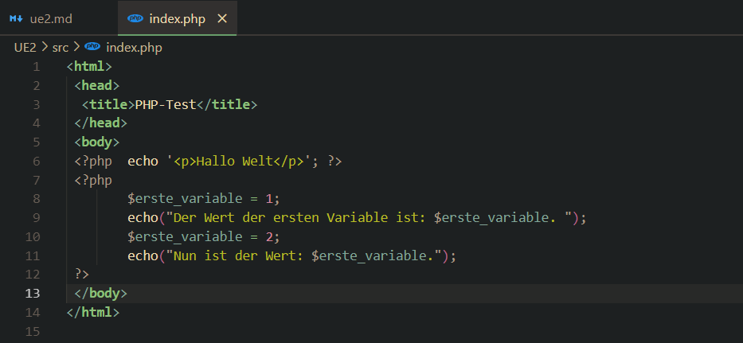
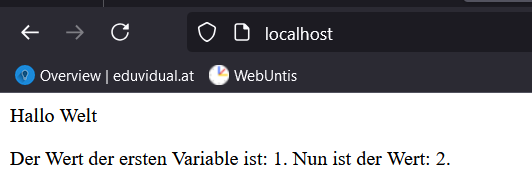

# Laboratoriumsübung UE2

---

__Schuljahr: 2024/25__
__Lehrgang: 2__
__Übungstag: 19.11.2024__
__Name: Säve Nouira__
__Klasse: 3a APC__
__Gruppe: C__

---

### Welche Information liefert die Funktion phpinfo(); ?

Diese Funktion liefert eine Menge an Informationen über die aktuelle __PHP-Konfiguration__. Einige davon sind:
- PHP-Version
- Systeminformationen
- Build Date
- Build System
- Compiler
- Architecture
- ...

---

### Wozu dienen folgende Optionen in der PHP.INI:
- __PHP-Fehler ausgeben__: error_reporting(E_ALL); ini_set('display_errors', 1);

- __Speichernutzung und die Laufzeit deiner Skripte limitieren__: Diese dienen um die Speichernutzung und Laufzeit zu limitieren. Hiermit hat man bessere Kontrolle über die Ressourcen die ein Skript verbrauchen kann. Diese kann man durch die Befehle __ini_set('memory_limit', 'xyzM');__ und __ini_set('max_execution_time', 'xyz');__.

- __allow_url_fopen=off__: Diese Option steuert, ob __PHP-Dateifunktionen__ wie _fopen()_, *file_get_contents()* und _include()_ URLs als Dateipfade akzeptiert werden können.

- __safe_mode=on__: Der Safe Mode war eine **Sicherheitsfunktion** in älteren PHP-Versionen, die bestimmte Einschränkungen für Skripte einstellte, um die Sicherheit zu erhöhen.

- __session.auto_start=off__: Diese Option steuert, ob PHP automatisch eine Session startet, wenn ein Skript ausgeführt wird. 

### Beispiele laut Vorgabe
__Code:__

__Ausgabe:__

