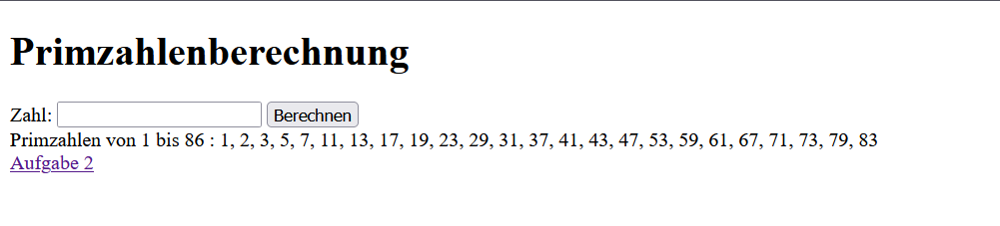
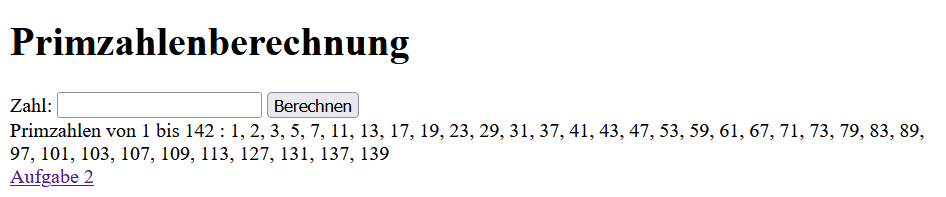
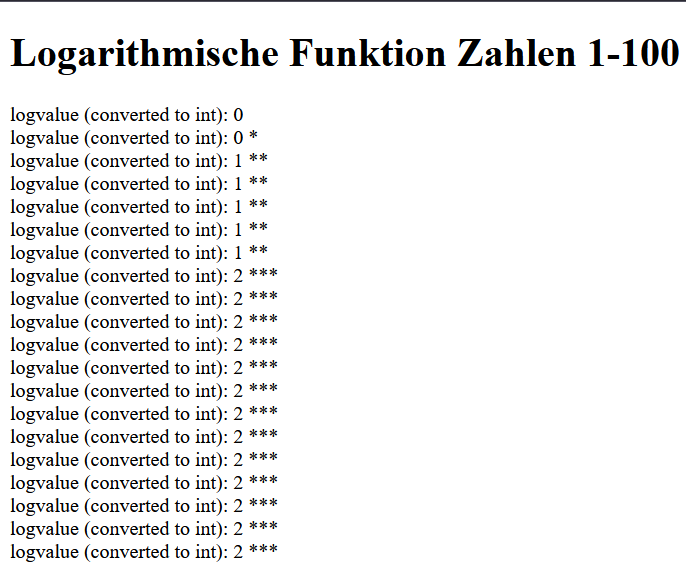
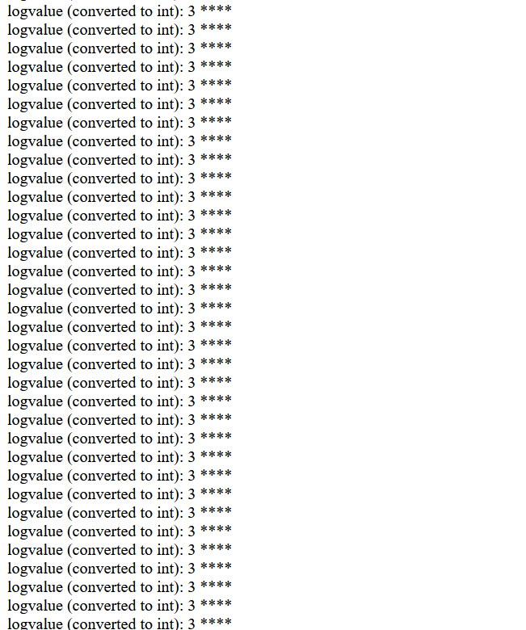
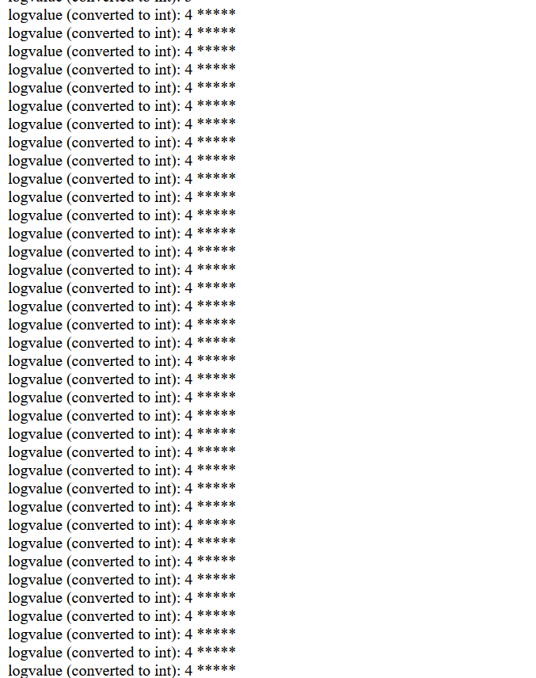
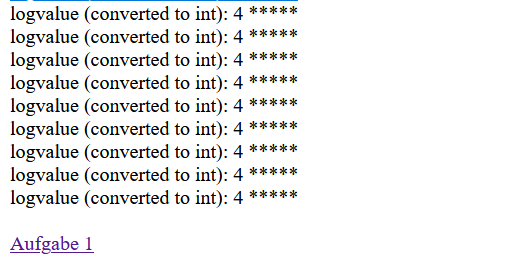

# Laboratoriumsübung UE3

---

__Schuljahr: 2024/25__

__Lehrgang: 2__

__Übungstag: 21.11.2024__

__Name: Säve Nouira__

__Klasse: 3a APC__

__Gruppe: C__

---

### Übung 1

Ausgabe bei dem Eingabewert __86__:

Ausgabe bei dem Eingabewert __142__:

---

### Übung 2

__Ausgabe:__

