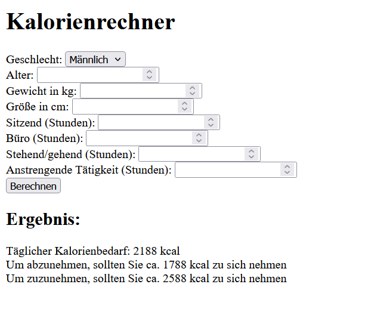
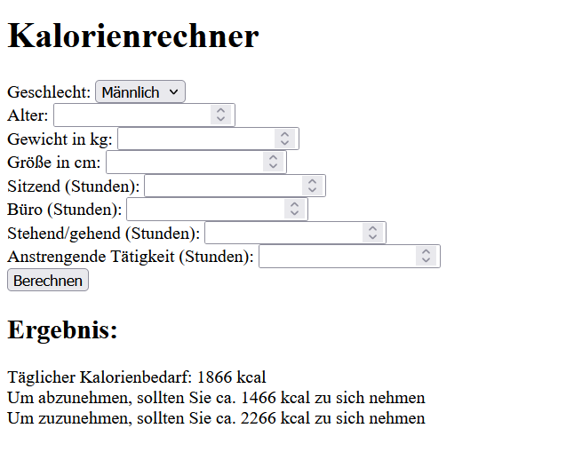

# Laboratoriumsübung UE (Vorlage)

---

__Schuljahr: 2024/25__

__Lehrgang: 2__

__Übungstag: 26.11.2024__

__Name: Säve Nouira__

__Klasse: 3a APC__

__Gruppe: C__

---

### Ausgabe des Progammierten Beispiels:

__Eingegebene Werte:__
- Geschlecht: Männlich
- Alter: 18
- Gewicht: 70
- Größe: 180
- Sitzende Arbeit: 2
- Büro-Arbeit: 9
- Stehende Arbeit: 1
- Anstregende Arbeit: 1

---

__Eingegebene Werte:__
- Geschlecht: Weiblich
- Alter: 20
- Gewicht 65
- Größe: 168
- Sitzende Arbeit: 2
- Büro-Arbeit: 5
- Stehende Arbeit: 2
- Anstregende Arbeit: 2

