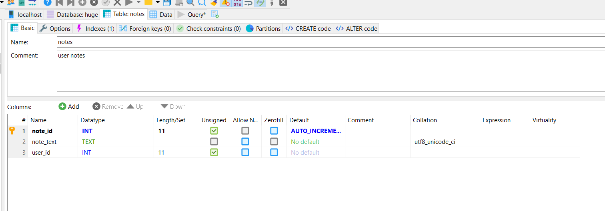

# Laboratoriumsübung UE5

---

__Schuljahr: 2024/25__

__Lehrgang: 2__

__Übungstag: 28.11.2024__

__Name: Säve Nouira__

__Klasse: 3a APC__

__Gruppe: C__

---

### Fragen

1. Wie sieht der Konstruktor in PHP Klassen aus?
- class xy {
    public function __construct($paramxyz) {
        // Code
    }
}

2. Wozu dient die "Variable" $this?
- Diese Variable wird innerhalb einer Klasse verwendet, um die aktuelle Instanz der Klasse zu referenzieren. Wie z.B. This in C++

3. Welche Vorteile hat die Verwendung von OOP in PHP
- Wiederverwendbarkeit
- Kapselung
- Vererbung
- Polymorphismus

4. Welche Datenkapselungsmethoden gibt es in PHP?
- public: Eigenschaften und Methoden sind überall zugänglich.
- protected: Eigenschaften und Methoden sind nur innerhalb der Klasse selbst und erbenden Klassen zugänglich.
- private: Eigenschaften und Methoden sind nur innerhalb der Klasse selbst zugänglich. 

5. Wie sehen abstrakte Klassen in PHP aus?
- abstract class AbstrakteKlasse {
    // CODE
}

--- 

### Aufgabe

#### Installation Composer

Zuerst habe ich den Composer-Installer für Windows von der offiziellen Seite heruntergeladen. 

Es war nur nötig, meinen Pfad anzugeben, in welchem ich PHP installiert habe. Alles andere war nicht erwähnenswert. 

Mit hilfe des Befehls ___composer___ konnte ich einfach überprüfen, ob die Installation erfolgreich war. 

#### Installation Huge-Framework

Mithilfe des oben gezeigten Befehls habe ich in einem leeren Verzeichnis ein Projekt mit der Basis des Huge-Frameworks erstellt. Es hat die benötigten Installationen durchgeführt. 

Nun habe ich wie gewohnt den Pfad meines Projektes in der ___httpd.conf___ - Datei geändert. Hier in diesem Fall musste ich es auf den ___public___ - Pfad des Huge-Frameworks setzen. 

Es gab einen Teil der Config-Datei die ich ändern musste um meine Datenbank zu finden. Die Datenbank habe ich selbst erstellen müssen. 

Somit ist meine Umgebung bereit für die nächste Übung!

#### Umsetzung des Demo-Auftrags

Nun habe ich versucht mich mit den bereitgestellten Login-Daten aus dem Bericht anzumelden.

Wie man sehen kann ist es erfolgreich gelungen, sich mit dem Demo-Account anzumelden!

---

### Dokumentation

#### Aus welchen Bausteinen besteht das Framework?

Hierzu ist ein Screenshot der derzeitigen Ordnerstruktur:

#### Wie sieht die Datenbank aus?

#### Wozu dient der public Ordner?
Dieser Ordner enthält Dateien, die der Benutzer __dirket über eine URL ansprechen kann__. 

Hier ist auch der __Einstiegspunkt _index.php___ gespeichert. 

Der Public Ordner sorgt für jegliche weitere Ordnerstruktur.

#### Beschreibe die Bausteine "Config, Model, Controller, Core, View"

- __Config__: Dies ist der Baustein der alle Konfigurationseinstellungen der Anwendungen abspeichert. Hier sind Verhalten wie z.B. Datenbankverbindungen, Sitzungsverwaltungen, ...

- __Model__: Dies ist der Baustein, der die Datenlogik verwaltet. Es ist die Schnittstelle zu den Datenbanken und anderen Datenquellen.

- __Controller__: Dieser ist der "Mittler" zwischen __Model__ und __View__. Es verarbeitet die Eingaben des Users und ruft die entsprechenden Modelle auf. 

- __Core__: Der Core-Baustein enthält die Grundlogik des Frameworks. Es sorgt dafür, dass die verschiedenen Teile zusammenarbeiten. 

- __View__: Der View-Baustein ist für die Darstellung der Daten verantwortlich, die vom Controller bereitgestellt werden. 

