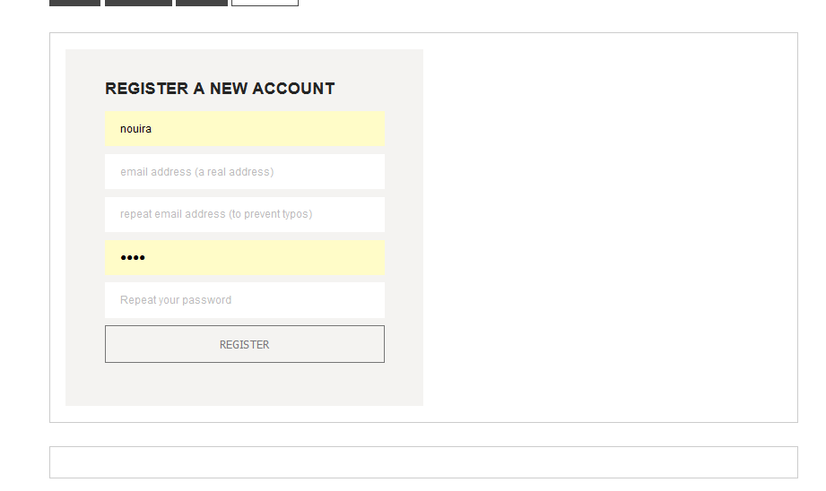
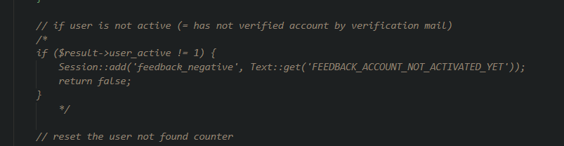

# Laboratoriumsübung UE (Vorlage)

---

__Schuljahr: 2024/25__

__Lehrgang: 2__

__Übungstag: 05.12.2024__

__Name: Säve Nouira__

__Klasse: 3a APC__

__Gruppe: C__

---

## Umsetzung

### Entfernen des Captchas + E-Mail - Verifizierung

### Captcha
Hierzu habe ich diverse Sachen auskommentiert in den Files ___index.php, RegistrationModel.php und RegisterController.php___. 

Somit kann man erkennen, dass das Captcha entfernt wurde: 

---

#### E-Mail
Hierzu habe ich Stellen aus ___RegisterController.php, RegistrationModel.php und LoginModel.php___ auskommentiert. 

### Nur Useranlage durch Admins
Hierfür habe ich zuerst aus dem File ___header.php___ die Regestrier-Karte rausgenommen und diese zu dem Tab hinzugefügt, den nur Admins sehen.

Nun habe ich die Überprüfung bei dem Rendern der Seite entfernt:

Somit ist dieser Tab nur sichtbar, wenn man einen Account mit Level 7 (admin) benutzt:

