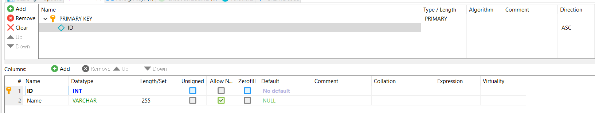
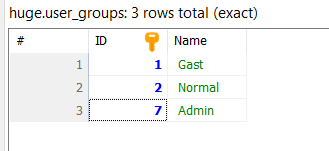
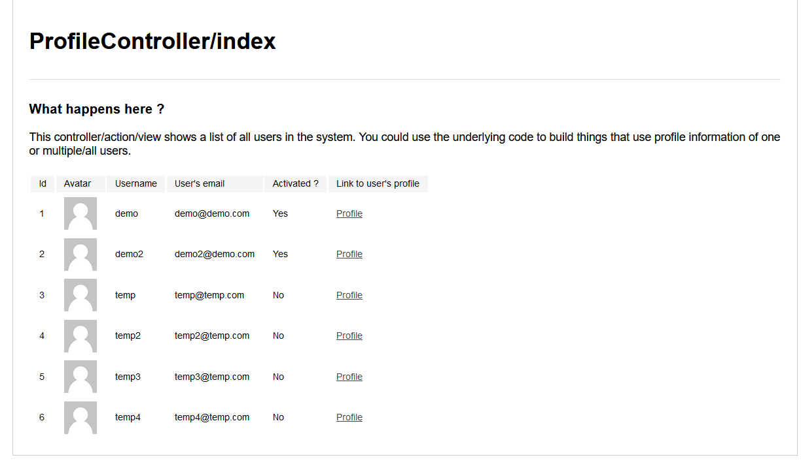
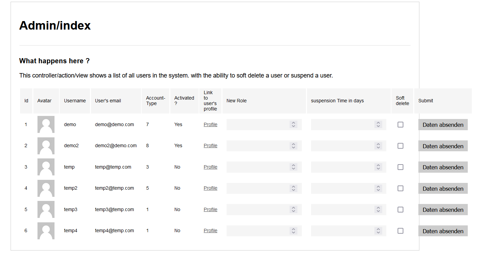

# Laboratoriumsübung UE (Vorlage)

---

__Schuljahr: 2024/25__

__Lehrgang: 2__

__Übungstag: 19.12.2024__

__Name: Säve Nouira__

__Klasse: 3a APC__

__Gruppe: C__

---

# Umsetzung

### Neue Tabelle anlegen

Zuerst habe ich eine neue Tabelle angelegt die die Bezeichnungen der User-Gruppen abspeichert. 

Nun habe ich die entsprechenden Werte hinzugefügt. 
^

### Code-Änderungen
Diese können einfach im Git-Repository gesehen werden (Sollten auch kommentiert sein)

# Ausgabe
Dies ist die Ausgabe für die regulären Benutzer (Nicht als Admin angemeldet => Anderes Fenster wird garnicht angezeigt)

Hier die Ausgabe für Admins:
